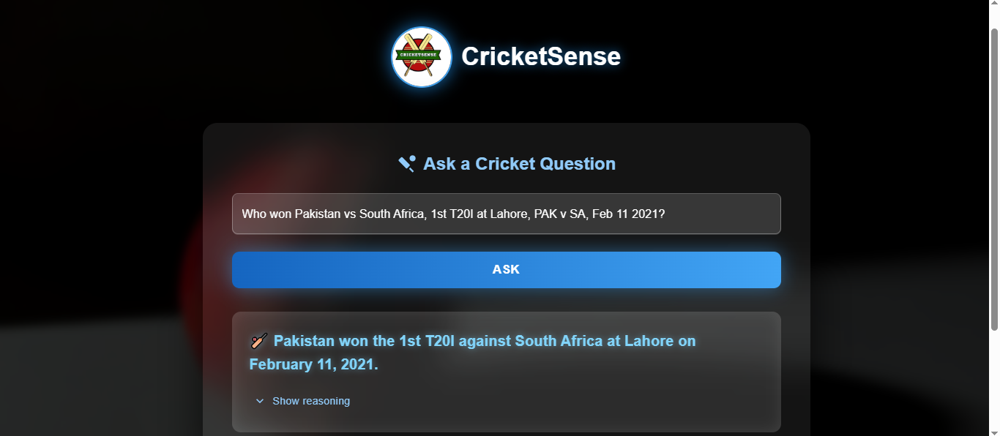
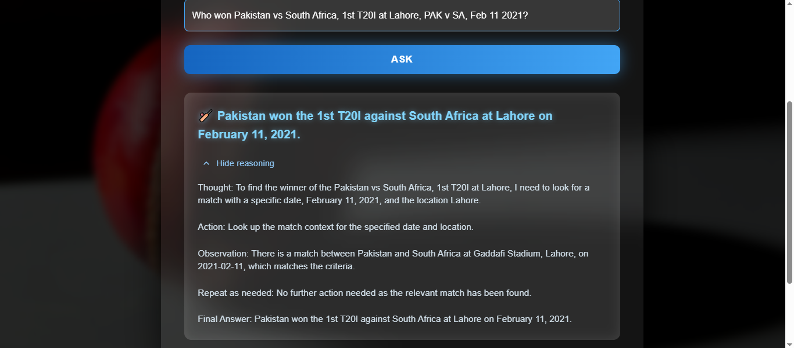
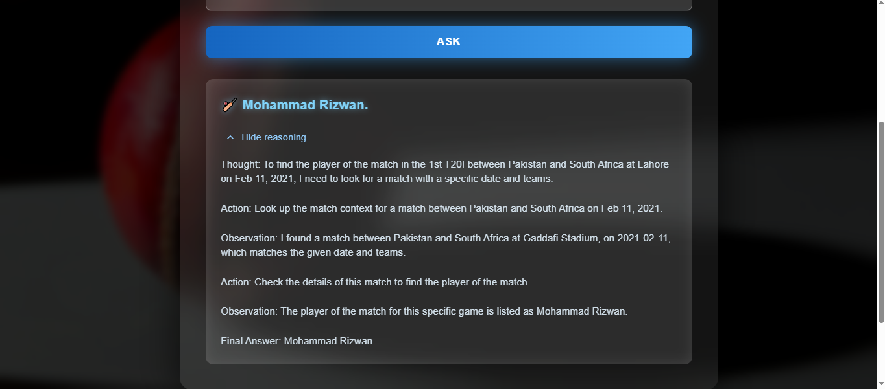
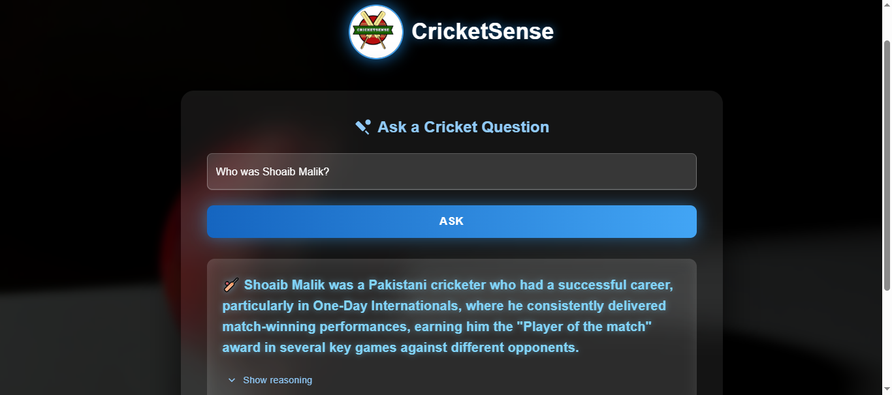
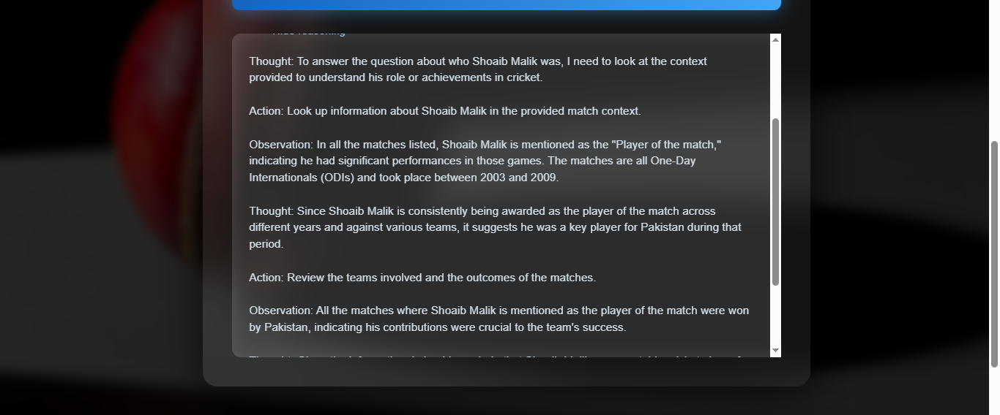
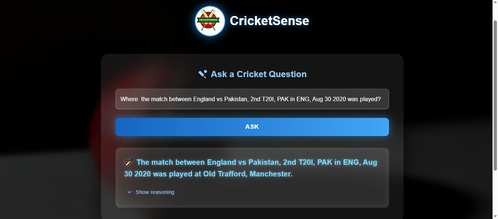

# 🏏 CricketSense

**CricketSense** is an AI-powered reasoning assistant that analyzes cricket-related data and provides meaningful answers with logical explanations.  
Built using **Python (FAISS + FastAPI)** for backend reasoning and **React + TypeScript (Vite)** for the frontend UI.

---

## 📂 Project Structure

cricketsense/
│
├── ai/ # Backend - FastAPI, FAISS, reasoning scripts
│ ├── app/
│ │ └── main.py # FastAPI entry point
│ ├── scripts/ # Data preprocessing and reasoning logic
│ ├── data/ # Contains FAISS index, metadata, etc.
│ ├── requirements.txt
│ └── .env # GROQ API key (to be created)
│
├── frontend/ # React + TypeScript frontend
│ ├── src/pages/ReasoningPage.tsx
│ ├── public/
│ ├── vite.config.ts
│ └── package.json
│
├── screenshots/ # UI previews
└── README.md

---

## 🖼️ Screenshots

Odd-numbered screenshots show **Question/Answer testing**  
Even-numbered screenshots show **Reason expanded view**

|                                    |                                    |
| ---------------------------------- | ---------------------------------- |
|  |  |
|  |  |
|  |  |
|  |                                    |

---

## ⚙️ Backend Setup (AI Folder)

### 1️⃣ Create Python Environment

cd ai
python -m venv cricketpythonenvironment
cricketpythonenvironment\Scripts\activate
pip install -r requirements.txt

### 2️⃣ Setup .env

Create a file named `.env` inside the `ai` folder and add your key:
GROQ_API_KEY=your_api_key_here

### 3️⃣ Download and Prepare Data

1. Create folder structure:
   ai/
   └── data/
   └── all_json_extracted/
2. Go to https://cricsheet.org/downloads/
   → Scroll to **By Match Type**
   → Download the **All Matches (Both Genders)** JSON archive
   → Extract and place all `.json` files into `ai/data/all_json_extracted/`

### 4️⃣ Preprocess and Build Index

Run the following scripts sequentially to prepare your dataset:
python scripts/preprocess.py
python scripts/build_faiss_index.py
python scripts/answer_match.py
python scripts/query_match.py
python scripts/reasoning_agent.py

These will generate:

- ai/data/matches_faiss.index
- ai/data/matches_metadata.csv
- ai/data/matches_summary.csv

### 5️⃣ Run the Backend Server

uvicorn app.main:app --reload

Server starts at http://127.0.0.1:8000

---

## 💻 Frontend Setup

cd frontend
npm install
npm run dev

Visit the app at http://localhost:5173

---

## 🌟 Features

- Ask AI-based cricket questions
- Expandable "Show Reason" section
- Python + React modular architecture
- Uses FAISS for semantic retrieval and Groq API for reasoning

---

## 🔮 Future Enhancements

- Integration with live cricket data APIs
- Context-aware reasoning improvements
- Enhanced UI/UX animations

---

## 🪪 License

Licensed under  
**Creative Commons Attribution-NonCommercial 4.0 International (CC BY-NC 4.0)**  
You are free to use, share, and adapt the project for **non-commercial** purposes with proper credit.

---

## 👨‍💻 Author

Developed by **Muhammad Ahmad**  
💡 Portfolio Project showcasing AI reasoning + Web integration.  
GitHub: [MuhammadAhmad777](https://github.com/MuhammadAhmad777)

### 🔗 Connect with Me

